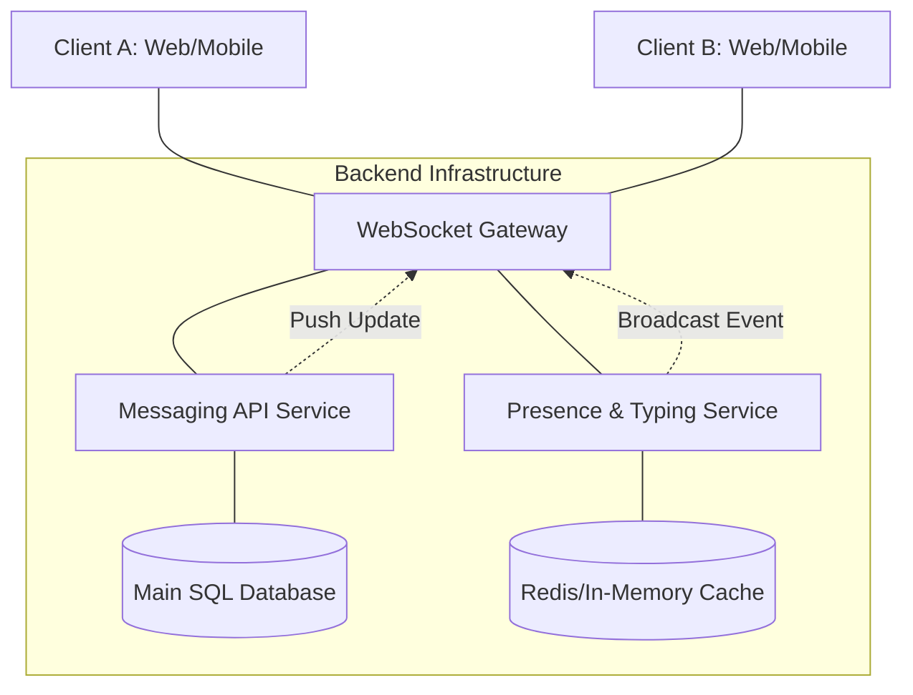
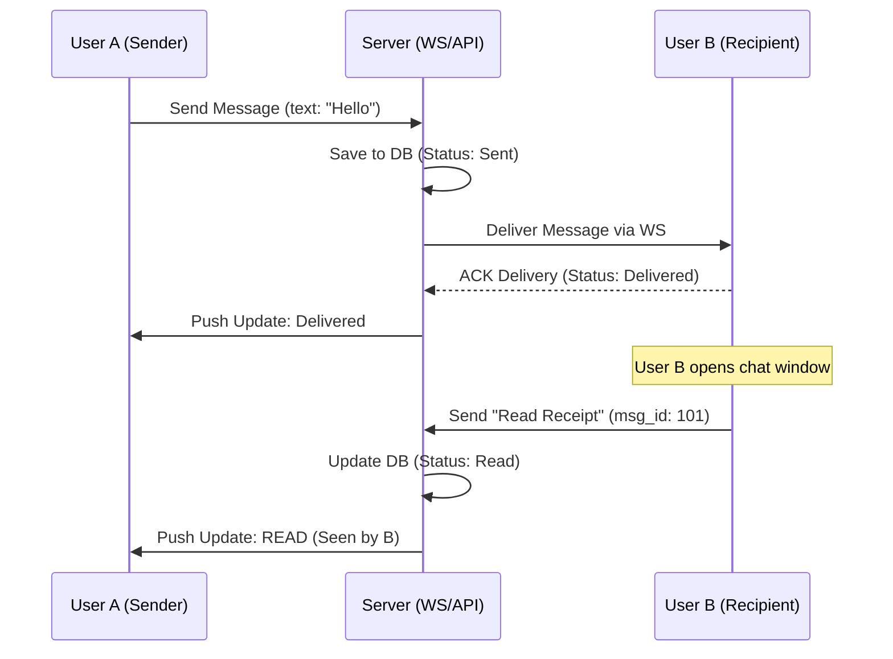

# Laboratory Work 1: Designing a Messaging System
**Student:** Artem  
**Variant:** 5 (Read Receipts & Typing Indicators)

## Goal
Design a real-time messaging system focusing on user presence, typing indicators, and message delivery lifecycle.

---

## Part 1 — Component Diagram

### Task
Create a **Component Diagram** that shows:
    - system components,
    - their responsibilities,
    - interactions between them (focusing on real-time events).

## Required components

    - Client (Web / Mobile): User interface for messaging.
    - WebSocket Gateway: Manages real-time bi-directional traffic
    - Messaging API: Handles persistent message logic and read receipts.
    - Presence & Typing Service: Processes ephemeral "typing" events.
    - Main SQL Database: Stores messages and their permanent statuses.
    - Redis Cache: Fast storage for transient typing indicators.



```markdown
Component Responsibilities
    WebSocket Gateway: Підтримує постійні з'єднання з клієнтами для миттєвої доставки повідомлень та статусів.
    Messaging API: Обробляє бізнес-логіку надсилання повідомлень та фіксацію статусів "Read" у базі даних.
    Presence & Typing Service: Керує "м'якими" станами (хто онлайн, хто друкує) без навантаження на основну БД.
    Redis Cache: Зберігає тимчасові дані (статус друку, ID сесій) для максимально швидкого доступу.
```

---

## Part 2 — Sequence Diagram: Read Receipt

### Scenario
User **A sends** a message; **User B** receives and reads it, triggering a status update back to **User A**.

### Task
Describe the interaction sequence in time for message delivery and read confirmation.



---

## Part 3 — State Diagram: Typing Indicator

### Object
Typing Session 

### Task
Describe the typing indicator lifecycle.

stateDiagram-v2
    [*] --> Idle: User is viewing chat
    Idle --> Typing: Keystroke detected
    Typing --> Typing: Continues typing (Reset 3s timer)
    Typing --> Idle: Timer expires (Inactivity)
    Typing --> Idle: Message sent
    Typing --> Idle: Input field cleared

---

## 📚 Part 4 — ADR (Architecture Decision Record)

```markdown
# ADR-002: Handling Typing Indicators via WebSocket without Persistence

## Status
Accepted

## Context
Real-time features like "User is typing..." generate a high volume of small, short-lived events. Persisting every keystroke in a relational database would cause unnecessary I/O load and latency.

## Decision
Use a specialized Presence Service that broadcasts typing events through WebSockets. 
- Events are held in Redis (in-memory) with a short TTL (Time-To-Live).
- Typing indicators are never written to the main SQL database.
- If the recipient is offline, the "typing" event is silently discarded.

## Alternatives
- HTTP Long Polling (rejected due to high overhead)
- Database Persistence (rejected due to DB bloat for short-lived data)

## Consequences
+ Extremely low latency for a better UX
+ Scales efficiently without affecting main database performance
- No historical tracking of typing patterns
```