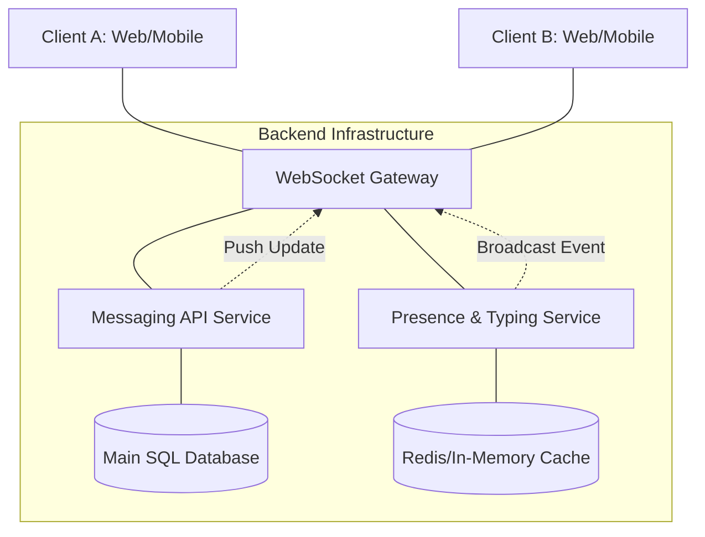

# Laboratory Work 1: Designing a Messaging System
**Student:** Artem  
**Variant:** 5 (Read Receipts & Typing Indicators)

## 🎯 Goal
Design a real-time messaging system focusing on user presence, typing indicators, and message delivery lifecycle.

---

## 🧱 Part 1 — Component Diagram
This diagram illustrates the separation between persistent message data and ephemeral real-time events (typing indicators).

Component Responsibilities:

    WebSocket Gateway: Manages persistent bi-directional connections for instant updates.

    Messaging API: Handles business logic for sending messages and updating "Read" statuses in the DB.

    Presence & Typing Service: Manages "soft" states like who is online and who is currently typing.

    Redis Cache: Stores transient data (typing status, session IDs) for high-speed access.

## 🔁 Part 2 — Sequence Diagram: Read Receipt
Scenario: User A sends a message; User B receives and reads it, triggering a status update back to User A.

sequenceDiagram
    participant A as User A (Sender)
    participant S as Server (WS/API)
    participant B as User B (Recipient)

    A->>S: Send Message (text: "Hello")
    S->>S: Save to DB (Status: Sent)
    S->>B: Deliver Message via WS
    B-->>S: ACK Delivery (Status: Delivered)
    S->>A: Push Update: Delivered
    
    Note over B: User B opens chat window
    
    B->>S: Send "Read Receipt" (msg_id: 101)
    S->>S: Update DB (Status: Read)
    S->>A: Push Update: READ (Seen by B)

## 🔄 Part 3 — State Diagram: Typing Indicator

Entity: Typing Session Lifecycle.

stateDiagram-v2
    [*] --> Idle: User is viewing chat
    Idle --> Typing: Keystroke detected
    Typing --> Typing: Continues typing (Reset 3s timer)
    Typing --> Idle: Timer expires (Inactivity)
    Typing --> Idle: Message sent
    Typing --> Idle: Input field cleared

## 📚 Part 4 — ADR (Architecture Decision Record)
ADR-002: Handling Typing Indicators via WebSocket without Persistence

Status: Accepted

Context:
Real-time features like "User is typing..." generate a high volume of small, short-lived events. Persisting every keystroke event in a relational database would cause unnecessary I/O load and latency.

Decision:
We will use a specialized Presence Service that broadcasts typing events through WebSockets.

    Events are held in Redis (in-memory) with a short TTL (Time-To-Live).

    Typing indicators are never written to the main SQL database.

    If the recipient is offline, the "typing" event is silently discarded.

Alternatives:

    HTTP Long Polling: Rejected due to high overhead and latency.

    Database Persistence: Rejected as it creates massive DB bloat for data that loses value after 5 seconds.

Consequences:

    (+) Extremely low latency for a better UX.

    (+) Scales efficiently without affecting database performance.

    (-) No historical tracking of typing patterns (not required for this system).