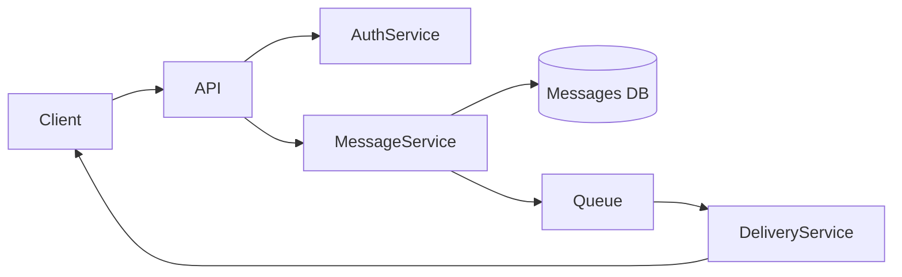
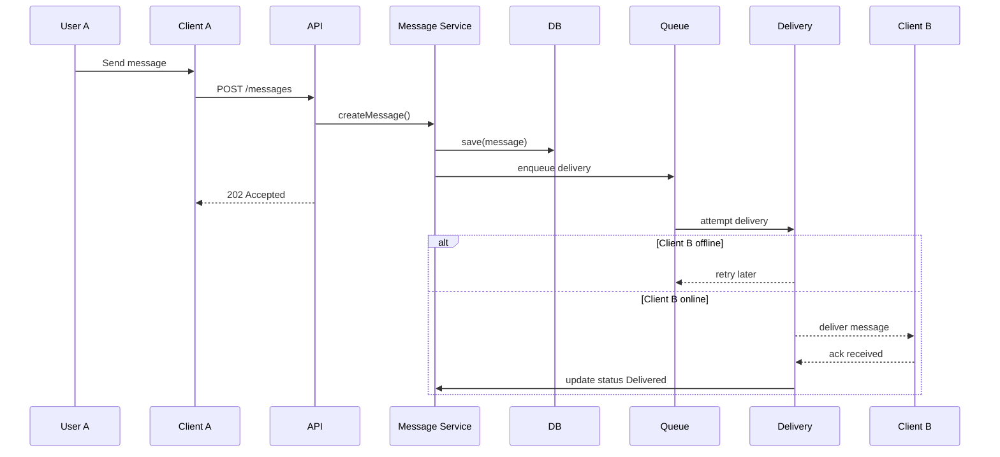
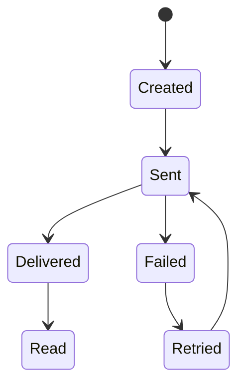

# 🧪 Laboratory Work 1
## Designing a Messaging System

## 🔹 Variant 1 — Basic One-to-One Messaging
**Focus:** basic system architecture

**Requirements:**
- One user sends messages to another user
- No group chats
- Online and offline users supported

**Key questions:**
- Where are messages stored?
- How is delivery guaranteed?

---

## Part 1 — Component Diagram (30%)

### Task
Create a **Component Diagram** that shows:
- system components,
- their responsibilities,
- interactions between them.

### Required components
- Client (Web / Mobile)
- Backend API
- Message Service
- Database
- Delivery mechanism (Queue / WebSocket / Push)




---

## Part 2 — Sequence Diagram (25%)

### Scenario
User **A sends a message** to user **B who is offline**.

### Task
Describe the interaction sequence in time.



---

## Part 3 — State Diagram (20%)

### Object
`Message`
### Task
Describe the **message lifecycle**



---

## Part 4 — RFC (Request for Comments) (15%)

### Topic
- Message delivery strategy for online and offline users

```markdown
# RFC: Message Delivery Strategy

## Context
Users can be online or offline when messages are sent.

## Problem
Messages must not be lost and delivery status must be reliable.

## Proposed Solution
- Use asynchronous delivery with a message queue.
- Client B sends **acknowledgement** after receiving a message.
- Messages remain in the queue until ack is received.
- Retry delivery for offline users until successful.

## Alternatives
- Direct delivery only (rejected)
- Client polling (considered)

## Consequences
+ Reliable delivery even if user is offline
+ Delivery status tracked accurately
- Higher infrastructure complexity due to queue and retry logic
```

---

## Part 5 — ADR (Architecture Decision Record) (10%)

### Architecture Decision
```markdown
# ADR-001: Use Message Queue for Delivery

## Status
Accepted

## Decision
Message delivery will be handled asynchronously using a queue.

## Consequences
- Messages survive client disconnects
- Delivery reliability improved
- Additional infrastructure required
```
