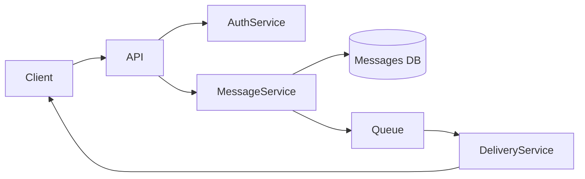
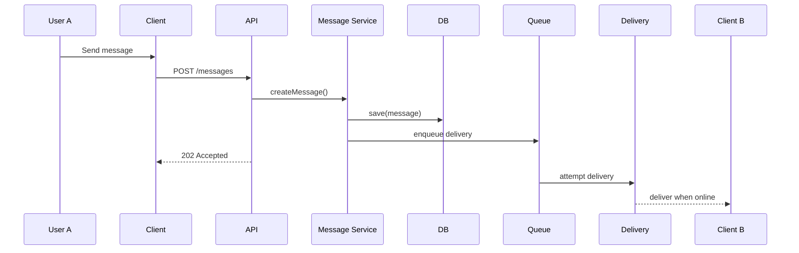
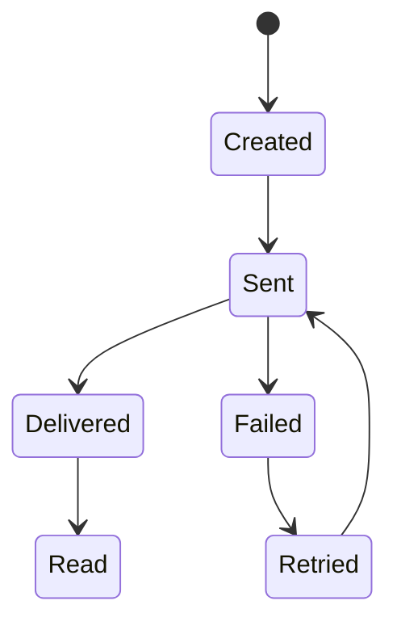

# 🧪 Laboratory Work 1
## Designing a Messaging System

## 🔹 Variant 1 — Basic One-to-One Messaging
**Focus:** basic system architecture

**Requirements:**
- One user sends messages to another user
- No group chats
- Online and offline users supported

**Key questions:**
- Where are messages stored?
- How is delivery guaranteed?

---

## Part 1 — Component Diagram (30%)

### Task
Create a **Component Diagram** that shows:
- system components,
- their responsibilities,
- interactions between them.

### Required components
- Client (Web / Mobile)
- Backend API
- Message Service
- Database
- Delivery mechanism (Queue / WebSocket / Push)




---

## Part 2 — Sequence Diagram (25%)

### Scenario
User **A sends a message** to user **B who is offline**.

### Task
Describe the interaction sequence in time.



---

## Part 3 — State Diagram (20%)

### Object
`Message`
### Task
Describe the **message lifecycle**



---

## Part 4 — RFC (Request for Comments) (15%)

### Topic
- Message delivery strategy for online and offline users

```markdown
# RFC: Стратегія доставки повідомлень

## Контекст
Користувачі можуть бути онлайн або офлайн під час надсилання повідомлень.

## Проблема
Повідомлення не повинні втрачатися, а статус доставки має бути надійним.

## Запропоноване рішення
Використовуйте асинхронну доставку з чергою повідомлень та підтвердженнями клієнта.

## Альтернативи
- Тільки пряма доставка (відхилено)
- Опитування клієнта (розглядається)

## Наслідки
+ Надійна доставка
- Вища складність інфраструктури
```

---

## Part 5 — ADR (Architecture Decision Record) (10%)

### Architecture Decision
```markdown
# ADR-001: Використовувати чергу повідомлень для доставки

## Статус
Прийнято

## Рішення
Доставка повідомлень буде оброблятися асинхронно за допомогою черги.

## Наслідки
- Повідомлення зберігаються навіть після відключення клієнта
- Покращено надійність доставки
- Потрібна додаткова інфраструктура
```
