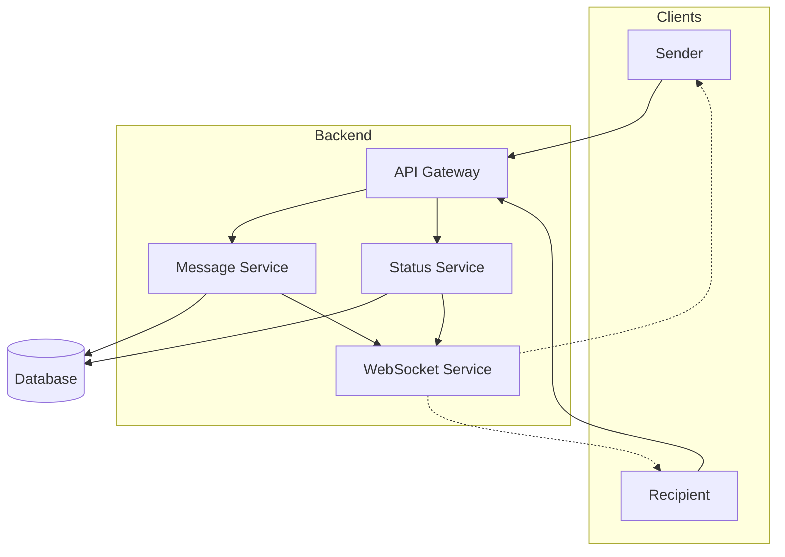
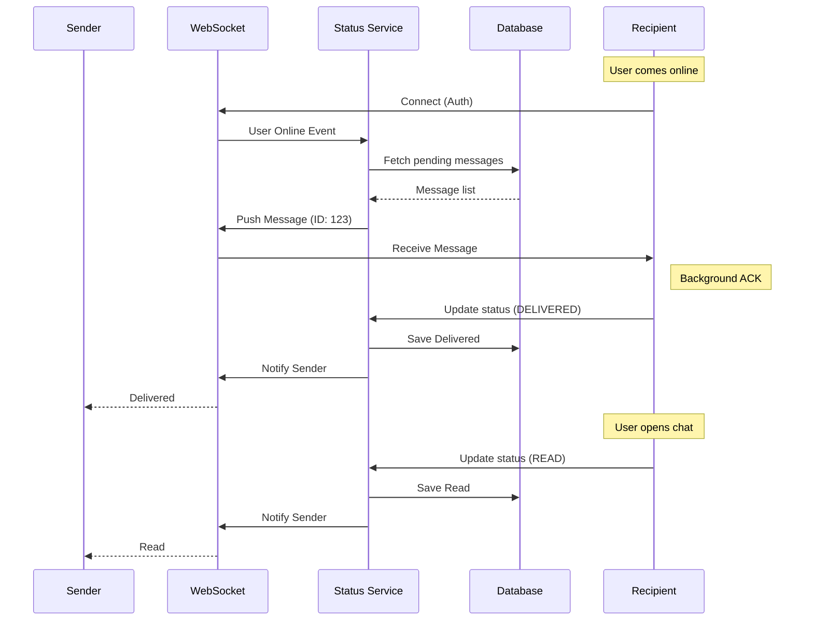
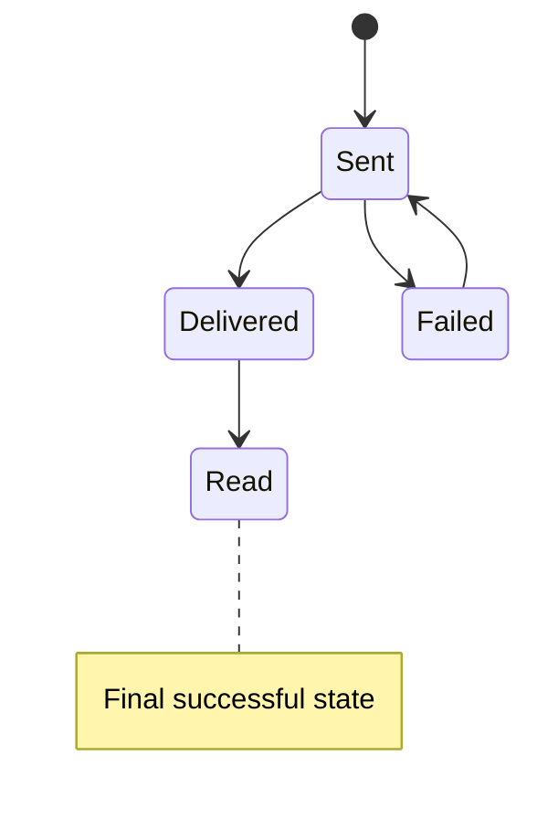

# 🧪 Laboratory Work 1: Messaging System Design

## Variant 2 — Message Status Tracking

---

## 🎯 Goal

Design a distributed messaging system with reliable **message lifecycle management** and **status synchronization** (`sent`, `delivered`, `read`) between clients.

The system must ensure **consistency**, **fault tolerance**, and **real-time updates** in a mobile environment.

---

## 🧩 Functional Requirements

1. Support 1-to-1 messaging between users
2. Support offline delivery (store-and-forward pattern)
3. Track message states:

   * `Sent` — stored in the database
   * `Delivered` — received by recipient device
   * `Read` — viewed by recipient
4. Provide real-time updates via WebSockets

---

## 🧱 Part 1 — Component Diagram

The architecture separates message handling from status tracking to improve scalability and performance.

**Design Decision:**

* `Message Service` handles message storage
* `Status Service` handles frequent updates
* Separation allows independent scaling

---

## 🔄 Part 2 — Sequence Diagram

### Scenario: Delivery and Read Receipt

---

## 🔁 Part 3 — State Diagram

---

## 🏗️ Part 4 — ADR-002: Explicit Client Acknowledgments

### Status

Accepted

### Context

Server-side delivery does not guarantee that a message is received by the client due to network issues or application failures.

### Decision

Use explicit client acknowledgments:

* Client sends `DELIVERED` after receiving message
* Client sends `READ` when message becomes visible

### Alternatives

* Implicit delivery — unreliable
* Polling — inefficient

### Consequences

* High reliability
* Accurate status tracking
* Better user experience

- Additional network requests
- Increased database load

---

## 💡 Design Explanation

This system follows an **event-driven architecture**:

* Events trigger immediate updates
* WebSockets ensure real-time communication

Key principles:

1. **Consistency** — all clients see the same message state
2. **Decoupling** — services scale independently
3. **Reliability** — acknowledgments guarantee correctness

---

## 🛡️ Defense Preparation

**1. What if the app is deleted before reading the message?**
Status remains `Delivered` — correct behavior.

**2. Why separate Status Service?**
Status updates are more frequent → better scalability.

**3. How detect Failed state?**
Using timeout (TTL) and retry logic.

**4. Can message go from Sent → Read instantly?**
Technically yes, but logically passes through Delivered.

**5. What if ACK is lost?**
Client retries sending ACK until confirmed.

---

## ✅ Conclusion

A distributed messaging system with reliable message tracking was designed.

The architecture ensures consistency and real-time updates using WebSockets and explicit acknowledgments.
Separation of services improves scalability and system performance.

The system successfully supports offline delivery and accurate message state synchronization.
